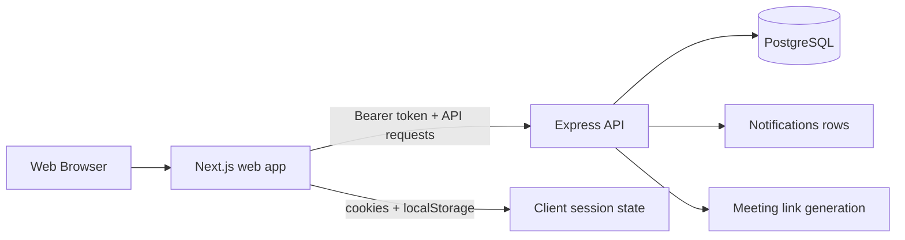
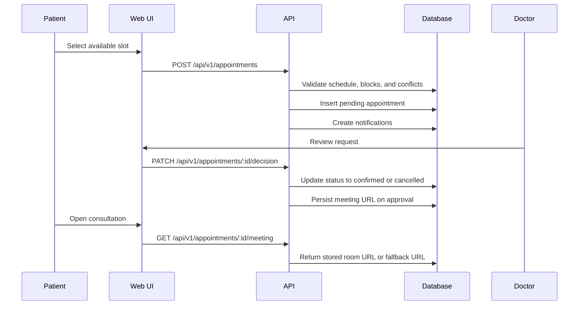

# Implementation Notes - 2026-05-27

This document summarizes the work implemented over the last 24 hours across the frontend, backend, database, and deployment surface.

## What Changed

The main work completed during this window was the telehealth flow end-to-end:

- role-aware authentication and route protection
- doctor discovery, booking, rescheduling, and approval flows
- doctor schedule management and one-off block management
- appointment lifecycle handling, including meeting links and consultation notes
- patient records, profile, and notifications views
- database schema support for the new workflow
- app shell and navigation refactors for both roles
- meeting-integration groundwork and dependency setup

## Architecture Overview

The app is split into a Next.js frontend, an Express backend, and a PostgreSQL database running in Docker.

The design is intentionally role-based:

- patients see discovery, booking, rescheduling, records, and personal notifications
- doctors see schedule management, patient lists, appointment decisions, and consultation tools

## Frontend

### Shared shell and role navigation

Files:

- [frontend/src/components/shared/app-shell.tsx](../frontend/src/components/shared/app-shell.tsx)
- [frontend/src/app/patient/patient-shell.tsx](../frontend/src/app/patient/patient-shell.tsx)
- [frontend/src/app/doctor/doctor-shell.tsx](../frontend/src/app/doctor/doctor-shell.tsx)

The main shell was consolidated into a reusable client component that powers both roles.

What it now handles:

- active route title resolution from the current pathname
- responsive sidebar behavior for mobile and desktop
- role-specific navigation definitions
- notification badges in the header
- logout handling wired to both `localStorage` and document cookies

The patient and doctor shells only provide the role-specific nav items and logout behavior.

### Authentication entry points

Files:

- [frontend/src/app/login/page.tsx](../frontend/src/app/login/page.tsx)
- [frontend/src/app/register/page.tsx](../frontend/src/app/register/page.tsx)
- [frontend/src/lib/auth.ts](../frontend/src/lib/auth.ts)
- [frontend/src/app/doctor/layout.tsx](../frontend/src/app/doctor/layout.tsx)
- [frontend/src/app/patient/layout.tsx](../frontend/src/app/patient/layout.tsx)

Login and register now do more than submit credentials:

- store `authToken` and `authUser` in `localStorage`
- mirror the same values into cookies so server layouts can read the role on first render
- redirect by role after success
- guard doctor and patient route groups on the server using `getCurrentUser()`

This gives the app a hybrid session model:

- client state for UX and browser interactions
- server-side layout redirects for route protection

### Patient workflows

Files:

- [frontend/src/app/patient/dashboard/page.tsx](../frontend/src/app/patient/dashboard/page.tsx)
- [frontend/src/app/patient/doctors/page.tsx](../frontend/src/app/patient/doctors/page.tsx)
- [frontend/src/app/patient/doctors/[id.tsx]/page.tsx](../frontend/src/app/patient/doctors/[id.tsx]/page.tsx)
- [frontend/src/app/patient/appointments/page.tsx](../frontend/src/app/patient/appointments/page.tsx)
- [frontend/src/app/patient/records/page.tsx](../frontend/src/app/patient/records/page.tsx)
- [frontend/src/app/patient/profile/page.tsx](../frontend/src/app/patient/profile/page.tsx)
- [frontend/src/app/patient/notifications/page.tsx](../frontend/src/app/patient/notifications/page.tsx)

The patient experience now covers the full booking path:

- doctor discovery with search and filters
- doctor detail view with availability slots
- appointment request creation from an available slot
- appointment list, reschedule, cancel, and meeting launch actions
- medical records and notification views
- profile page backed by the authenticated user payload

The booking UI no longer relies on free-form date/time input. It now derives selectable slots from the doctor availability API so the UI matches backend scheduling rules.

### Doctor workflows

Files:

- [frontend/src/app/doctor/dashboard/page.tsx](../frontend/src/app/doctor/dashboard/page.tsx)
- [frontend/src/app/doctor/appointments/page.tsx](../frontend/src/app/doctor/appointments/page.tsx)
- [frontend/src/app/doctor/schedule/page.tsx](../frontend/src/app/doctor/schedule/page.tsx)
- [frontend/src/app/doctor/patients/page.tsx](../frontend/src/app/doctor/patients/page.tsx)
- [frontend/src/app/doctor/profile/page.tsx](../frontend/src/app/doctor/profile/page.tsx)
- [frontend/src/app/doctor/notifications/page.tsx](../frontend/src/app/doctor/notifications/page.tsx)

The doctor side now supports:

- review of pending and confirmed appointments
- opening the consultation link for an appointment
- weekly schedule editing
- adding one-off blocked time ranges
- viewing treated patients and patient details
- profile and notification management

### Shared UI and local data

Files:

- [frontend/src/components/shared/avatar.tsx](../frontend/src/components/shared/avatar.tsx)
- [frontend/src/components/shared/status-badge.tsx](../frontend/src/components/shared/status-badge.tsx)
- [frontend/src/components/shared/empty-state.tsx](../frontend/src/components/shared/empty-state.tsx)
- [frontend/src/components/ui/dialog.tsx](../frontend/src/components/ui/dialog.tsx)
- [frontend/src/lib/dashboard-data.ts](../frontend/src/lib/dashboard-data.ts)
- [frontend/src/lib/appConfig.tsx](../frontend/src/lib/appConfig.tsx)

The shared UI work focused on making the dashboards usable with a small set of reusable pieces:

- avatar initials and status chips
- a reusable empty state component
- dialog primitives for slot selection and confirmation flows
- local data helpers for dashboard and appointment mock content
- canonical specialization and display constants shared by the UI

## Backend

### API structure

Files:

- [backend/src/index.ts](../backend/src/index.ts)
- [backend/src/routes/auth.ts](../backend/src/routes/auth.ts)
- [backend/src/routes/doctors.ts](../backend/src/routes/doctors.ts)
- [backend/src/routes/appointments.ts](../backend/src/routes/appointments.ts)
- [backend/src/routes/profile.ts](../backend/src/routes/profile.ts)
- [backend/src/routes/patients.ts](../backend/src/routes/patients.ts)
- [backend/src/routes/notifications.ts](../backend/src/routes/notifications.ts)

The API now exposes a cleaner modular layout:

- `/api/v1/auth`
- `/api/v1/doctors`
- `/api/v1/appointments`
- `/api/v1/profile`
- `/api/v1/patients`
- `/api/v1/notifications`

The server is configured with `helmet`, `cors`, `morgan`, and JSON body parsing, and it still exposes a lightweight `/health` endpoint for liveness checks.

### Authentication and request context

Files:

- [backend/src/middleware/auth.ts](../backend/src/middleware/auth.ts)
- [backend/src/controllers/auth.ts](../backend/src/controllers/auth.ts)
- [backend/src/services/auth.ts](../backend/src/services/auth.ts)

Auth is built around JWT bearer tokens:

- login and register issue signed tokens
- `auth` middleware validates the bearer token and attaches `req.user`
- the authenticated user object becomes the base context for nearly every protected endpoint

This keeps the route handlers thin while pushing validation and access rules into the service layer.

### Doctors module

Files:

- [backend/src/controllers/doctors.ts](../backend/src/controllers/doctors.ts)
- [backend/src/services/doctors.ts](../backend/src/services/doctors.ts)
- [backend/src/middleware/doctors.ts](../backend/src/middleware/doctors.ts)

The doctor module now covers both public discovery and doctor-owned management flows.

Implemented behavior:

- public doctor listing with search, specialization, day-of-week, and pagination filters
- doctor detail fetch by ID
- computed availability generation for booking UI
- weekly schedule read and replace operations
- one-off block creation
- doctor patient list retrieval
- doctor-owned patient profile access control

Important design detail:

- access to patient profile data is gated by a confirmed or completed appointment relationship
- doctor-owned schedule and block writes are validated before touching the database

### Appointments module

Files:

- [backend/src/controllers/appointments.ts](../backend/src/controllers/appointments.ts)
- [backend/src/services/appointments.ts](../backend/src/services/appointments.ts)

This is the most workflow-heavy part of the backend.

Supported actions:

- create appointment request
- list current user appointments
- approve or reject as a doctor
- reschedule as a patient
- cancel by either participant
- mark complete as a doctor
- create, read, update, and delete consultation notes
- resolve appointment meeting links on demand

Key business rules:

- only patients can create and reschedule appointments
- only doctors can approve, reject, and complete appointments
- appointment creation checks the doctor schedule, one-off blocks, and existing appointment conflicts
- only confirmed appointments can produce a meeting link
- appointment approval currently assigns a fallback meeting URL using Jitsi if no persisted room exists yet

### Patient records and profile modules

Files:

- [backend/src/controllers/patients.ts](../backend/src/controllers/patients.ts)
- [backend/src/services/patients.ts](../backend/src/services/patients.ts)
- [backend/src/controllers/profile.ts](../backend/src/controllers/profile.ts)
- [backend/src/services/profile.ts](../backend/src/services/profile.ts)

These modules support the user-facing account views and the patient records page.

They provide:

- the authenticated patient record list
- profile retrieval with role-specific profile payloads
- doctor-specific access rules for patient profile reads

### Notifications

Files:

- [backend/src/controllers/notifications.ts](../backend/src/controllers/notifications.ts)
- [backend/src/services/notifications.ts](../backend/src/services/notifications.ts)

Notifications are used as the lightweight event trail for appointment actions.

The current implementation creates notifications for:

- new appointment requests
- appointment approvals and rejections
- appointment cancellations

## Database

### Schema

Files:

- [docker/init.sql](../docker/init.sql)
- [backend/src/db/seed.ts](../backend/src/db/seed.ts)
- [docs/database.md](../docs/database.md)

The schema now supports the full telehealth workflow:

- `users` as the base identity table
- `patient_profiles` for patient-specific data
- `doctor_profiles` for doctor-specific data
- `doctor_schedules` for recurring weekly availability
- `doctor_schedule_blocks` for one-off unavailability windows
- `appointments` for booking lifecycle state
- `consultation_notes` for clinical documentation
- `notifications` for user-facing events

Important appointment metadata now includes:

- `duration_minutes`
- `approved_at`
- `rejected_at`
- `rejection_reason`
- `cancelled_by`
- `cancelled_at`
- `completed_at`

### Scheduling model

The availability model is layered:

1. weekly schedule rows define normal recurring hours
2. one-off blocks remove special dates or closures
3. confirmed and pending appointments reserve slots

This means the backend, not the frontend, is the source of truth for bookable times.

### Seed data

The seed flow now builds a realistic demo dataset that matches the current schema and app navigation.

The seed script populates the core records in dependency order so foreign key relationships remain valid.

## Appointment and Meeting Flow

This is the central user journey implemented during this window.

The current behavior is:

- patients request a time from the availability picker
- doctors approve or reject the request
- confirmed appointments expose a meeting URL
- the UI can open that meeting from either participant’s appointment list

## Libraries and Dependencies

### Backend

- `express` for HTTP routing and middleware
- `pg` for PostgreSQL access
- `jsonwebtoken` for bearer token creation and verification
- `bcryptjs` for password hashing
- `cors` for cross-origin requests from the web app
- `helmet` for baseline HTTP hardening
- `morgan` for request logging
- `dotenv` for environment configuration

### Frontend

- `next` for the app router and server layouts
- `react` / `react-dom` for client components and hooks
- `tailwindcss` for utility-first styling
- `class-variance-authority`, `clsx`, and `tailwind-merge` for component class composition
- `radix-ui` and the local shadcn-style primitives for dialog and form surfaces
- `lucide-react` for iconography

### Meeting and auth groundwork

- `@google-apps/meet`
- `@google-cloud/local-auth`

These dependencies were added as part of the meeting-integration work. The current live flow still uses persisted meeting URLs and a Jitsi fallback in the appointment service, but the dependency setup is in place for the Google Meet path.

## Development and Validation

Current repo-level scripts used during this work:

- `npm run dev`
- `npm run docker:up`
- `npm run db:migrate`
- `npm run db:seed`
- `npm run type-check --workspace=frontend`
- `npm run type-check --workspace=backend`

The implementation is now organized so each layer owns its own concerns:

- frontend handles navigation, interaction, and presentation
- backend handles validation, authorization, and state transitions
- database owns persistence and invariant enforcement
